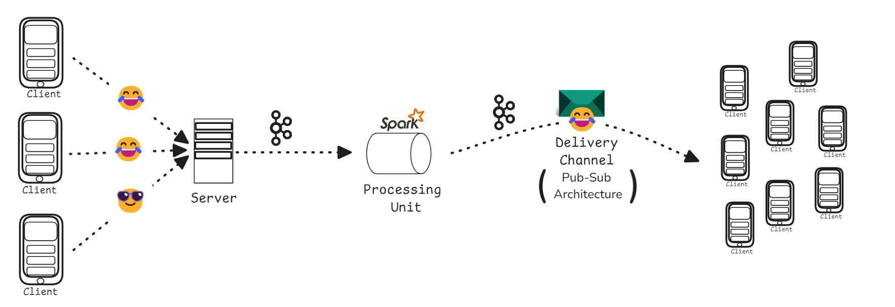
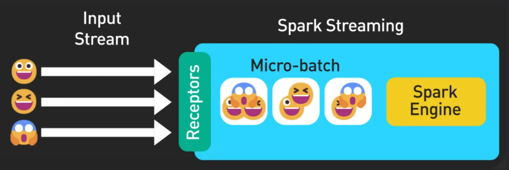
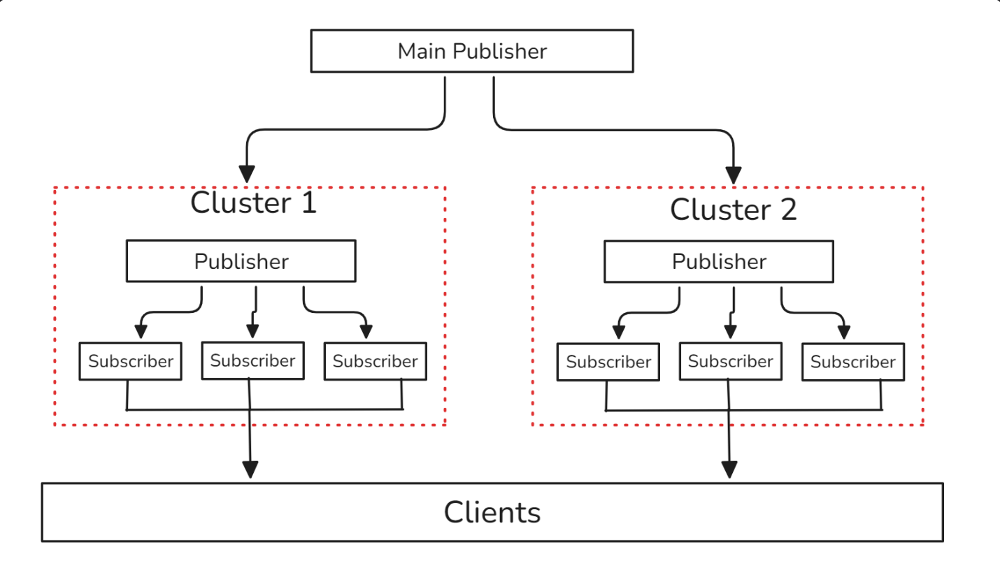

# EmoStream: Concurrent Emoji Broadcast over Event-Driven Architecture

## Project Overview

Emojis reflect the dynamic sentiments of fans in real-time. When Virat is batting, everyone’s hoping for boundaries with every ball; when he’s on the field, they’re cheering for wickets. Capturing these user-generated signals as they flow in, distilling them into an emoji swarm that mirrors the crowd’s mood, and displaying these shifting emotions live is a major challenge—especially with billions of emoji reactions anticipated over the tournament.

## Goal

The project's goal is to design and implement a scalable system that enhances the viewer experience on platforms like Hotstar by capturing and processing billions of user-generated emojis in real time during live sporting events. This will involve creating a horizontally scalable architecture using frameworks such as Kafka for data streaming and Spark for real-time data processing. The system will enable high concurrency and low latency, ensuring user interactions are seamless.

## Application Architecture

## There are three main stages in the architecture:

### 1. Handling client requests and writing it to queue

**Step 1:** Setting up the API Endpoint. 
Using a lightweight framework like Flask (Python) or Express.js (Node.js) to create an HTTP endpoint for users to send emoji data. 
Each user sends a POST request with emoji data, which includes:User ID, Emoji type, Timestamp. 
Created a function in this endpoint that asynchronously writes to the Kafka producer. 

**Step 2:** Emoji data from the backend servers is pushed to Kafka as a message queue. 
Setting up a flush interval of 500 milliseconds for the kafka producer to send the buffered message to the kafka broker. 

### 2. Processing stream of data over an interval(2 seconds) to compute aggregate of the date
Consumer will consume a stream of data from Kafka broker and computes aggregates of the data over an interval. Time interval should be small enough to provide a real-time experience to users. 2 seconds is preferred. 
Process data in chunks making use of the Micro-batching model for streaming in Spark. 

### 3. Delivering processed messages realtime to the clients and scaling for a large number of users

**Main Publisher:** This is the entry point for publishing messages. It handles incoming requests and forwards messages to the appropriate clusters. 

**Message Queuing System:** Use a message broker like Apache Kafka or RabbitMQ to facilitate communication between the main publisher and the cluster publishers. This ensures decoupling and reliability. 

**Clusters:** Each cluster will consist of a cluster publisher and multiple subscribers. The cluster publisher listens for messages from the main publisher via the message queue and sends them to its subscribers. 

**Subscriber Groups:** Each cluster can have multiple subscribers. Subscribers send it directly to the end-users (clients) in real-time. 

